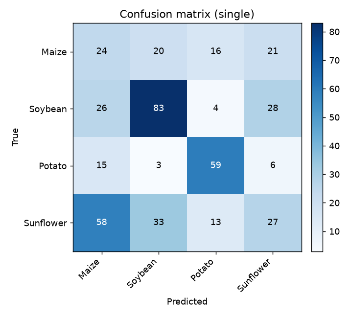
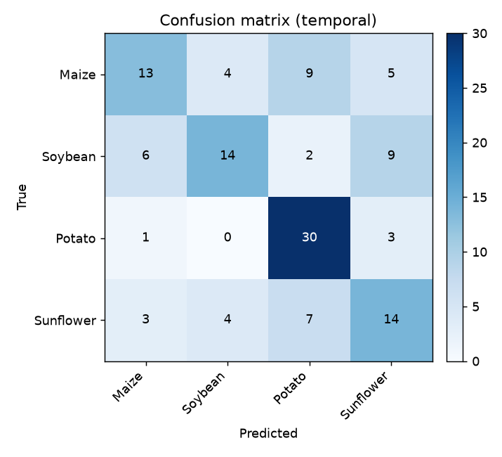
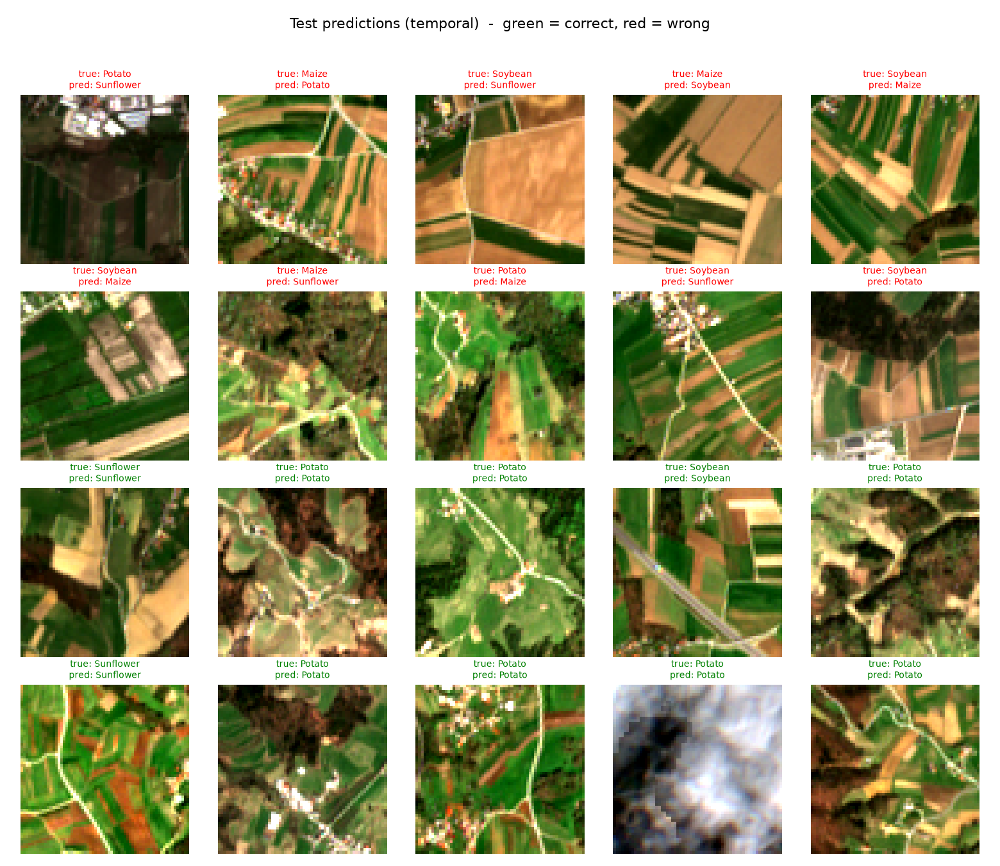

# Crop Type Classification from Sentinel-2 (ResNet18 + PyTorch Lightning)

Classify the crop growing in a farmland parcel from Sentinel-2 imagery, using a
ResNet18 CNN. Two approaches are compared: a **single-image** model (Phase 1) and
a **temporal** model that sees the field across the growing season (Phase 2).

See [`plan.md`](plan.md) for the design and [`doc.md`](doc.md) for a full
pipeline walkthrough.

**Status:** Phase 1 and Phase 2 complete. Region: Slovenia, 2021.

---

## Results

Crops: **Maize, Soybean, Potato, Sunflower**. Scores on a held-out, spatially
separated test set.

| Model | Accuracy | Macro-F1 |
|-------|---------:|---------:|
| Phase 1 — single seasonal image | 0.45 | 0.44 |
| **Phase 2 — temporal (6 dates + GRU)** | **0.56** | **0.55** |

Per-class F1:

| Crop | Phase 1 | Phase 2 |
|------|--------:|--------:|
| Maize | 0.24 | **0.48** |
| Sunflower | 0.25 | **0.48** |
| Soybean | 0.59 | 0.53 |
| Potato | 0.67 | **0.73** |

**Key finding:** in a single summer image, **maize and sunflower are constantly
confused** — two tall, green summer crops look identical. Adding the time
dimension (how each crop greens up and senesces) roughly **doubled** their F1.
This is the core result: crop timing (phenology) is the signal a single image
throws away.

*Caveat:* Phase 1 used 600 fields/class and Phase 2 a 200/class subset (to limit
download cost), so the per-class F1 pattern is more trustworthy than the exact
percentages. See [`doc.md`](doc.md) for limitations and next steps.

### Visuals

Confusion matrices — the temporal model has a much lighter off-diagonal
(fewer Maize/Sunflower mix-ups):

| Phase 1 (single image) | Phase 2 (temporal) |
|:---:|:---:|
|  |  |

Example predictions on the test set (green = correct, red = wrong):



Regenerate with `python -m src.visualize --mode temporal` (or `--mode single`).

---

## Setup

```bash
python -m venv .venv
# Windows PowerShell:  .venv\Scripts\Activate.ps1
pip install -r requirements.txt
```

### Use your NVIDIA GPU (optional but recommended for training)

`pip install -r requirements.txt` gives the **CPU-only** PyTorch. To train on an
NVIDIA GPU (e.g. RTX 4060), reinstall the CUDA build:

```bash
pip uninstall -y torch torchvision
pip install torch torchvision --index-url https://download.pytorch.org/whl/cu121
```

Check it worked:

```bash
python -c "import torch; print('cuda available:', torch.cuda.is_available())"
```

If it prints `True`, training uses the GPU automatically. (Training still runs
on CPU if you skip this — just slower.)

### Credentials (Sentinel Hub)

1. Create a free account / trial at the Copernicus Data Space Ecosystem (or
   sentinel-hub.com) and create an **OAuth client** (client id + secret).
2. Copy the template and fill it in:
   ```bash
   cp .env.example .env      # then edit .env
   ```

### Labels (EuroCrops)

1. Download your region's archive from the EuroCrops Zenodo record
   (https://github.com/maja601/EuroCrops has the links).
2. Unzip into `data/raw/eurocrops/` and confirm the filename + crop-name column
   match `configs/data.yaml` (`eurocrops_file`, `crop_class_column`).

---

## Run dataset preparation

```bash
# 1. Build the clean, sampled label table (inspect class counts):
python -m src.data.labels --config configs/data.yaml

# 2. Fetch patches + build tensors + make the spatial split:
python -m src.data.prepare_dataset --config configs/data.yaml
```

Outputs:
- `data/processed/labels.parquet` — sampled parcels with `parcel_id`, `crop_class`.
- `data/raw/patches/*.npy` — cached raw Sentinel Hub composites (fetched once).
- `data/processed/tensors/*.npy` — model-ready `(C, H, W)` tensors.
- `data/processed/splits.json` — spatially-blocked train/val/test parcel ids + labels.

Everything is cached: re-running skips parcels already fetched, so you never
re-spend Sentinel Hub processing units.

---

---

## Train and evaluate

```bash
# Phase 1 — single-image ResNet18
python -m src.train    --config configs/train.yaml
python -m src.evaluate --config configs/train.yaml     # confusion matrix

# Phase 2 — temporal (build the temporal dataset first, then train)
python -m src.data.prepare_dataset_temporal --config configs/data_temporal.yaml
python -m src.train_temporal                --config configs/train_temporal.yaml
```

Results are written to `outputs/results.txt` (Phase 1) and
`outputs/results_temporal.txt` (Phase 2).

---

## Pipeline layout

```
src/
├── data/
│   ├── labels.py               # EuroCrops -> filtered, sampled fields
│   ├── sentinelhub_client.py   # Sentinel Hub: cloud-free composites (+cache)
│   ├── patches.py              # UTM bbox, parcel mask, tensor assembly
│   ├── prepare_dataset.py      # Phase 1: build (C,H,W) tensors + split
│   ├── prepare_dataset_temporal.py  # Phase 2: build (T,C,H,W) tensors + split
│   ├── datamodule.py           # Phase 1 data loading
│   └── datamodule_temporal.py  # Phase 2 data loading
├── models/
│   ├── resnet18_single.py      # Phase 1 model
│   └── resnet18_temporal.py    # Phase 2 model (ResNet18 + GRU)
├── lit_module.py               # shared training logic (loss, metrics)
├── train.py / train_temporal.py
└── evaluate.py                 # confusion matrix + per-class report
```

For a full explanation of every stage, the parameters, limitations, and how to
improve the project, see [`doc.md`](doc.md).

---

## Limitations

- **Single region / single year.** Only Slovenia, 2021. The model may not
  transfer to other countries, climates, or years.
- **Uncontrolled Phase 1 vs Phase 2 comparison.** Phase 1 used 600 fields/class,
  Phase 2 a 200/class subset (to limit download cost). The per-class F1 *pattern*
  is trustworthy; the exact percentages are not a perfect A/B test.
- **Only 4 well-separated crops.** Real crop maps have dozens of classes,
  including very similar ones that are far harder.
- **Optical only.** Sentinel-2 is blocked by clouds; some time windows have few
  clear passes, so composites can be partly cloudy or empty (worse in winter).
- **Moderate accuracy.** 56% is a solid demonstration, not a production model.
- **Field context, not pure field.** The 64×64 window includes neighbors; the
  parcel mask helps but does not fully isolate the field.

## Future work

- **Fair, larger comparison** — re-run Phase 2 at the full 600/class and add more
  fields, so the two phases are directly comparable.
- **Stronger temporal model** — replace the GRU with a temporal-attention model
  (e.g. LTAE), which is state of the art for crop time-series and shows *which
  dates* drive the prediction.
- **Add Sentinel-1 radar** — sees through clouds, filling the gaps that break
  optical composites.
- **Better cloud handling** — explicit cloud masking + gap-filling per timestep.
- **More regions and years** — train across areas so the model generalizes
  instead of memorizing one region.
- **Explainability** — Grad-CAM (where it looks) + attention weights (which dates
  matter).
- **Interactive demo** — click a field on a map → see its NDVI-over-time curve
  and the predicted crop with probabilities.
